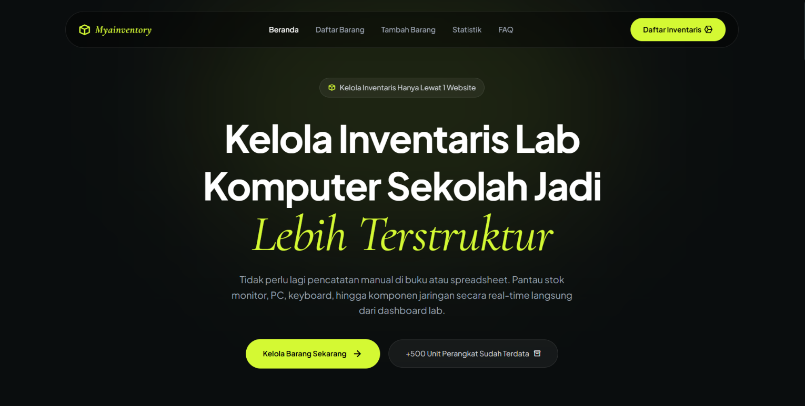
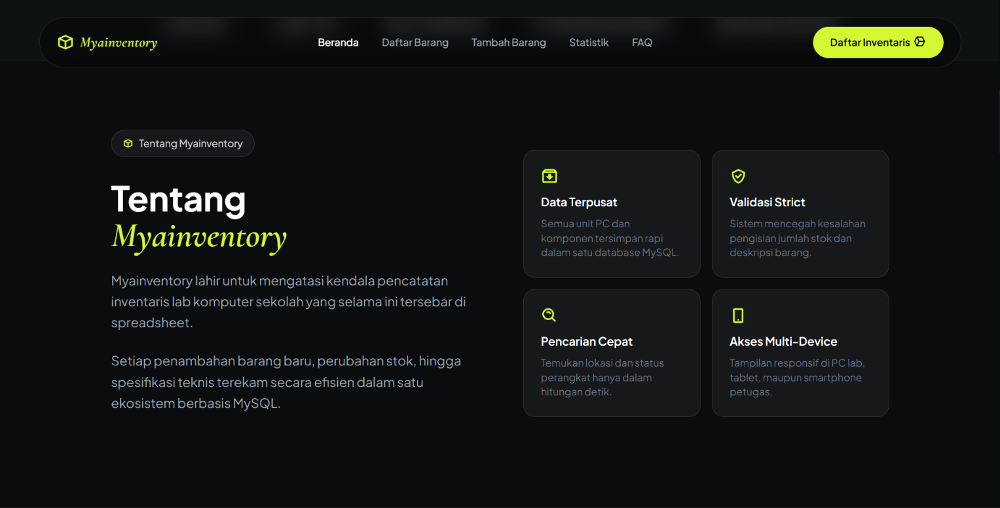
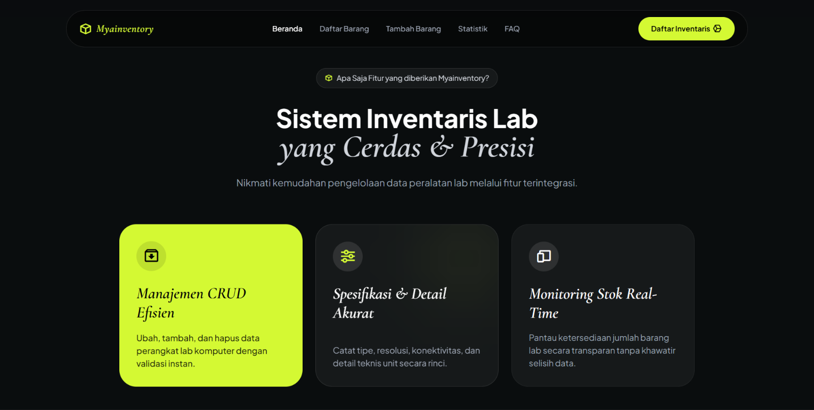
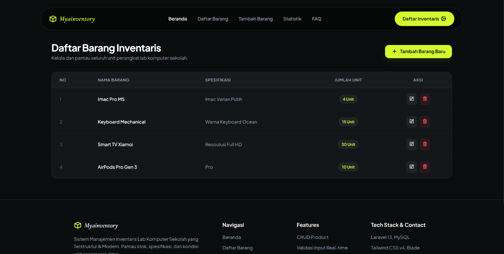
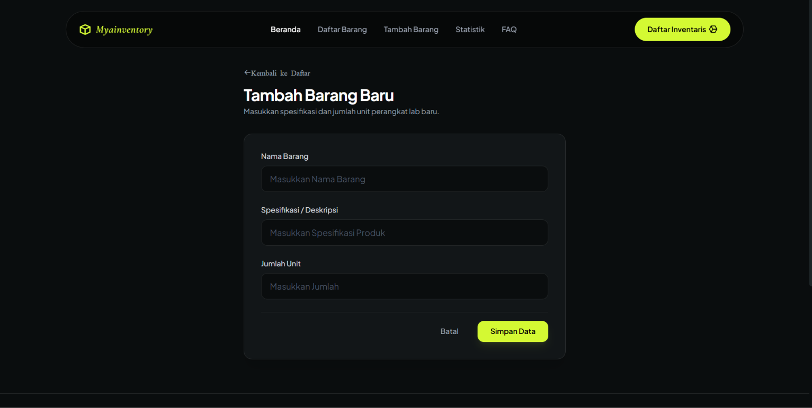
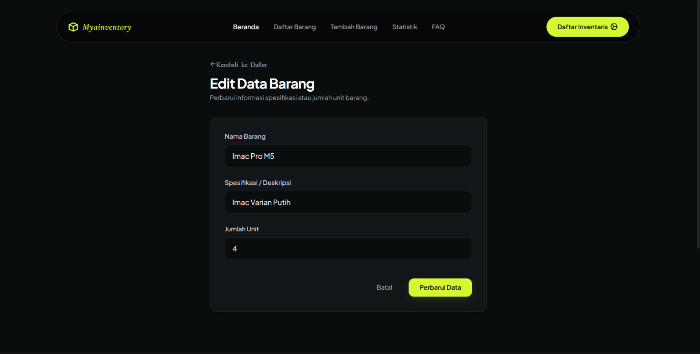

# Myainventory — Sistem Manajemen Inventaris Lab

Aplikasi web untuk pengelolaan data barang inventaris lab komputer sekolah.

**Pengembang:** I Gede Mahayana — XII RPL

## Hero Section

## About Section

## Features Section

## Daftar barang (nama, spesifikasi, jumlah)

## Penambahan data barang

## Pengubahan data barang

- Penghapusan data barang dengan konfirmasi
- Validasi formulir dan notifikasi aksi

## Prasyarat

- PHP 8.3+
- Composer
- MySQL
- Node.js & npm

## Instalasi

composer install
cp .env.example .env
php artisan key:generate

Konfigurasikan database pada `.env`, kemudian:

php artisan migrate:fresh --seed
npm install
npm run build
php artisan serve

## Pengembangan

Terminal 1: php artisan serve
Terminal 2: npm run dev

Akses: http://127.0.0.1:8000

## Tech Stack

Figma, Laravel 13, MySQL, Blade, Tailwind CSS v4, Vite, Dbingin, TablePlus
